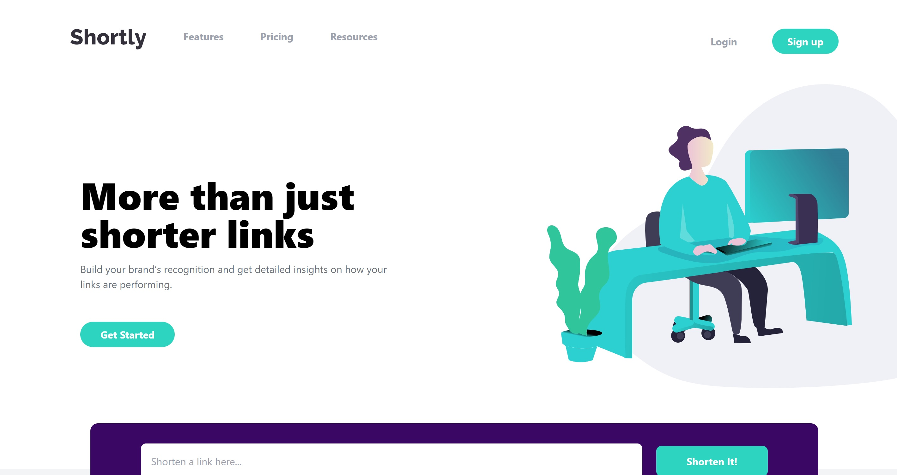
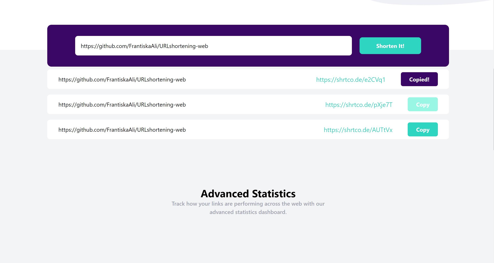
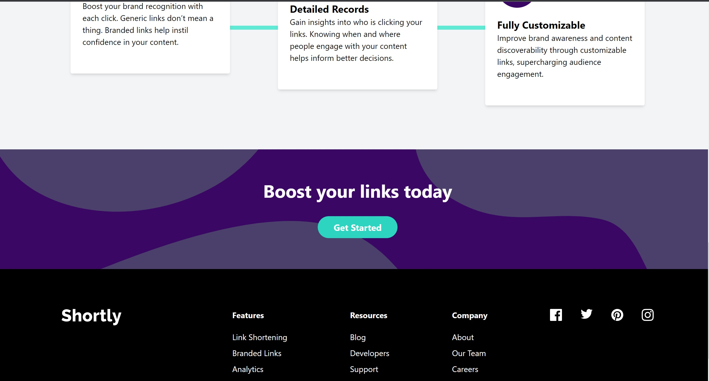
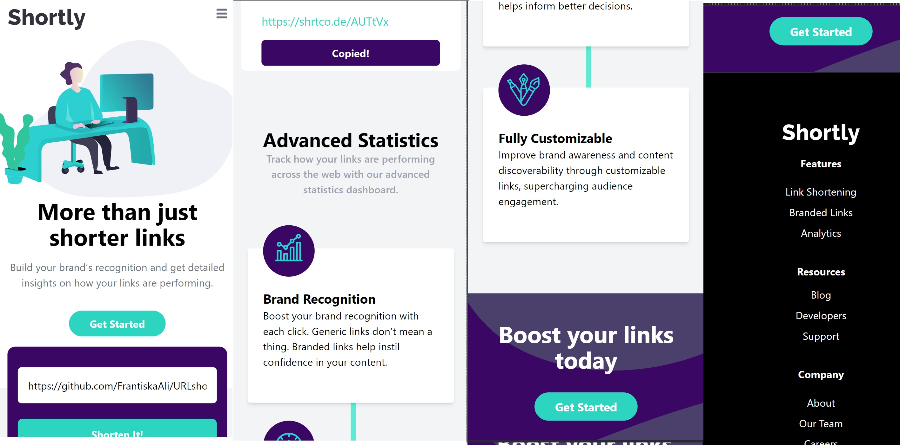

# URL shortening landing page
Challenge by frontend mentor created in next.js using React,API (fetch), Tailwind and Typescript
[Here](https://ur-lshortening-yjjrx2xyn-frantiskaali.vercel.app/) you can visit my challenge and see for yourself. 
## Table of content
- [Description and usage](#description-and-usage)
- [Installation](#installation)
- [My challenges](#challenges)
- [Authors](#authors)
## Description an usage
This is an URL shortening website landing page. I have started learning use of typescript on this project. It is simple one page , that uses API call to shorten urls. Layout is modern with lots of white space. The shortened URL then can be copied when clicked on the button. However i have decided not to save the URL in local storage ,as this page is mostly an advertisement.

## Installation
If you would like to add or improve our website, simply download our repository and run NPM install.

## Screenshots
### For desktop
- 
- 
- 

### Mobile view
- 

## My challenges
This project was easy on functionality, but I did actually find layout challenging, especially th hr element that is placed under the statistic boxes. Also I got myself into hydration error ,that drove me mad, fixed it by setting initial window width value to just a number instead of tenary checking for

## Author

- [Frantiska Rechkova](https://github.com/FrantiskaAli)
- [My frontend mentor](https://www.frontendmentor.io/profile/FrantiskaAli)